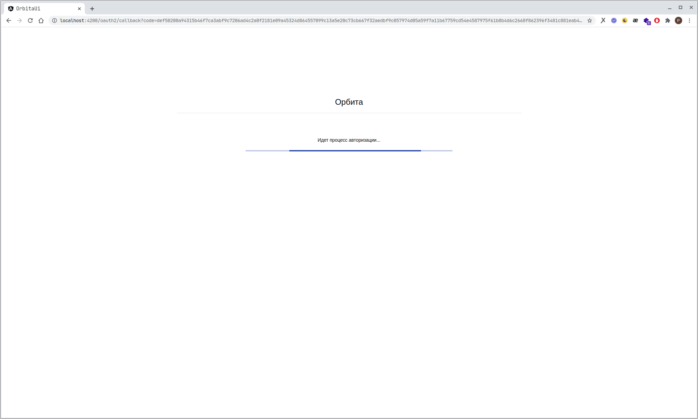
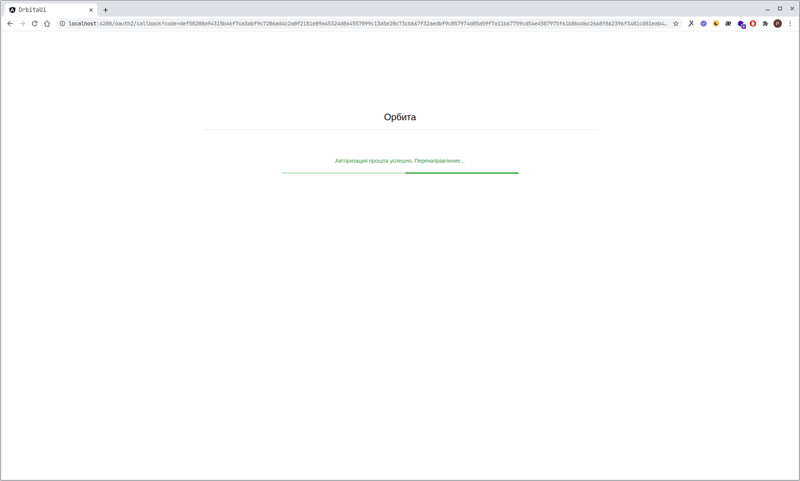
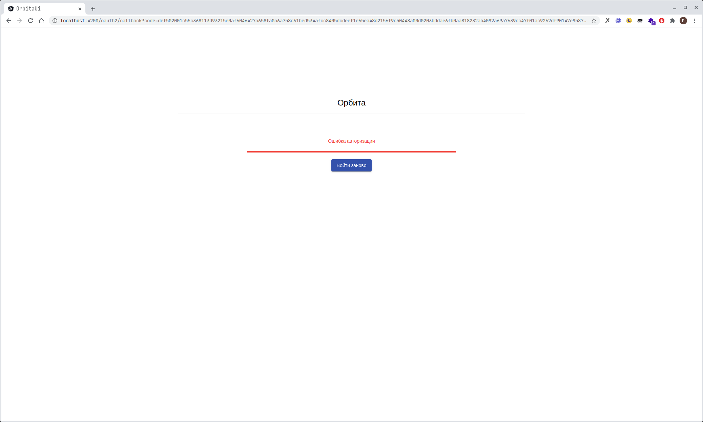
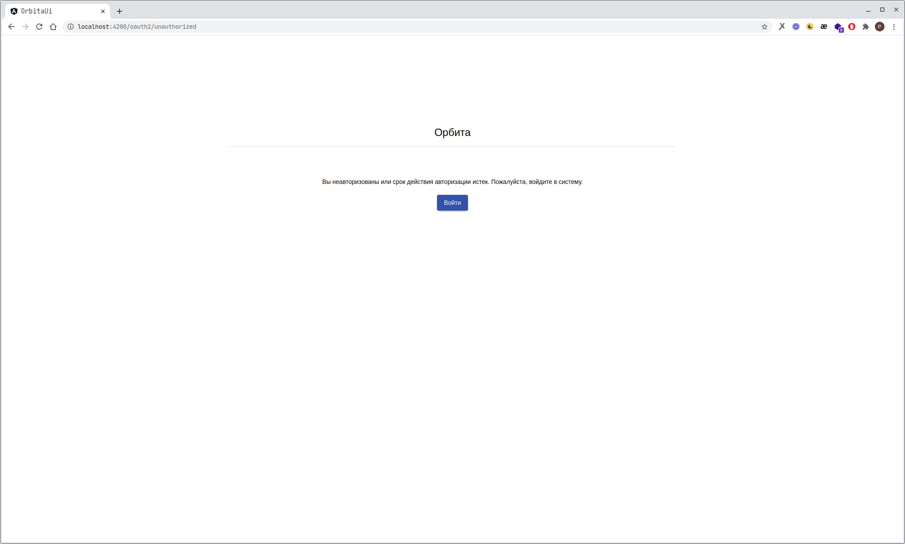

# ng-auth-center

Библиотека для авторизации по протоколу [OAuth2](https://gitlab.iss-reshetnev.ru/714/7143/inet-portal/-/wikis/home) через Личный Кабинет на Angular 2+.

Алгоритм работы библиотеки:
1. Клиентское приложение, использующее библиотеку, понимает, что пользователь не авторизован, и редиректит его в Центр Авторизации (параметр `authorizationServer`), где запрашивает логин и пароль;
2. ЦА, в случае верного логина/пароля, перенаправляет пользователя обратно на клиентское приложение по указанному адресу (параметр `redirectUrl`);
3. Клиентское приложение перенаправляет пользователя по адресу `/oauth2/callback`, выполняет `POST` запрос на сервер (параметр `serverUrl`) и передает параметр `code`, полученный от ЦА. Всё это происходит автоматически;
4. На вашем сервере **вам самим** необходимо реализовать обработчик, который сделает следующее:
    1. Получит параметр `code` от клиента;
    2. Обратится к ЦА для получения access_token (здесь потребуется секретный ключ, который выдает ЦА);
    3. Сгенерирует JWT, в который поместит необходимые для вашего приложения данные (например, данные о пользователе, access_token и т.д.);
    4. Вернет клиенту json объект вида `{ token: <jwt> }`;
5. Клиентское приложение в случае успешного ответа сервера перенаправляет пользователя на запрашиваемую страницу. JWT, который вернул сервер, теперь хранится в localStorage по ключу `jwt`. Пользователь будет считаться авторизованным, пока в localStorage имеется соответствующая запись и пока ваш сервер принимает jwt;

<br>

## Установка

### Настройка менеджера пакетов

Прежде чем устанавливать пакеты с областью видимости `@iss/...` необходимо настроить путь к внутрикорпоративному реестру пакетов. Если ваш менеджер пакетов уже настроен, этот шаг можно пропустить.

#### для npm:

`echo @iss:registry=https://gitlab.iss-reshetnev.ru/api/v4/packages/npm >> ~/.npmrc`

#### для yarn:

`echo "@iss:registry" "https://gitlab.iss-reshetnev.ru/api/v4/packages/npm" >> ~/.yarnrc`

<br>

### Установка библиотеки

#### для npm:

`npm i @iss/ng-auth-center`

#### для yarn:

`yarn add @iss/ng-auth-center`

<br>

**Внимание!** Для корректной работы библиотеки в проекте должны быть установлены следующие зависимости:
1. @angular/cdk (установка: `npm i @angular/cdk` или `yarn add @angular/cdk`)
2. @angular/material (установка: `npm i @angular/material` или `yarn add @angular/material`)
3. @auth0/angular-jwt (установка: `npm i @auth0/angular-jwt` или `yarn add @auth0/angular-jwt`)

<br>

## Использование

Импортируйте `AuthCenterModule` и добавьте его в список импортов проекта. Вызовите метод `forRoot` и передайте атрибуты, необходимые для работы библиотеки (список атрибутов описан [далее](#атрибуты-для-инициализации-authcentermodule)). Атрибуты лучше описать в файле `src/environment.ts`, чтобы в production режиме их можно было легко изменить.

Также убедитесь, что у вас импортирован `HttpClientModule` и `RouterModule`.

``` typescript
import { HttpClientModule } from '@angular/common/http';
import { AuthCenterModule } from '@iss/ng-auth-center';
import { AppRoutingModule } from './app-routing.module'; // <-- обычно файл с импортом RouterModule и маршрутами лежит отдельно от основного модуля.

import { environment } from '../environments/environment';

@NgModule({
  imports: [
    // ...  
    HttpClientModule,
    AuthCenterModule.forRoot(environment.auth),
    AppRoutingModule // <-- Убедитесь, что файл с маршрутами импортируется ПОСЛЕ модуля AuthCenterModule.
  ],
})
export class AppModule { }

```

<br>

Импортируйте стили в файле `angular.json` в раздел вашего проекта.

``` json
"styles": [
  "node_modules/@iss/ng-auth-center/assets/styles.scss",
  // ...
]
```

<br>

Библиотека предоставляет класс `AuthCenterGuard`, в котором реализован метод `canActivate` для активации маршрута, если пользователь авторизован. Для проверки авторизации в маршрутах импортируйте класс `AuthCenterGuard`. В случае, если пользователь не авторизован, он будет перенаправлен на страницу входа.

``` typescript
import { NgModule } from '@angular/core';
import { Routes, RouterModule } from '@angular/router';
import { AuthCenterGuard } from '@iss/ng-auth-center';

import { HomeComponent } from './home/home.component';

const routes: Routes = [
  {
    path: '',
    component: HomeComponent,
    canActivate: [AuthCenterGuard] // <-- Пример использования AuthCenterGuard класса.
  },
  {
    path: '**',
    redirectTo: ''
  }
];

@NgModule({
  imports: [RouterModule.forRoot(routes)],
  exports: [RouterModule]
})
export class AppRoutingModule { }
```

<br>

## Атрибуты для инициализации `AuthCenterModule`:

1. **authorizationServer** - адрес сервера авторизации (по умолчанию `https://auth-center.iss-reshetnev.ru/oauth/authorize`);
2. **serverUrl<sup>*</sup>** - адрес вашего сервера, который вернет вам JWT;
3. **cliendId<sup>*</sup>** - ID вашего приложения, выданный сервером авторизации;
4. **responseType** - запрашиваемый тип разрешения, может быть одним из следующих параметров: `code` - для запроса кода авторизации, `token` - для запроса токена доступа; (по умолчанию `code`);
5. **state** - используется для безопасности. Если его отправить, сервер авторизации вернет его обратно, чтобы вы могли убедиться, что это ответ именно на ваш запрос (по умолчанию пустая строка);
6. **redirectUrl<sup>*</sup>** - адрес, на который будет перенаправлен пользователь после успешной авторизации на сервере авторизации. **Внимание!** Не используйте в качестве корневого маршрута путь `/`;
7. **scope** - список разрешений, необходимых приложению (по умолчанию пустой). Указывать через запятую без пробелов.
8. **appName<sup>*</sup>** - имя приложения которое будет отображаться на странице входа
9. **jwtOptions** - объект, содержащий два параметра `allowedDomains` и `disallowedRoutes`. 
    1. **allowedDomains** - список доменов, для которых будет добавляться заголовок `Authorization` с содержимым `Bearer <JWT>`
    2. **disallowedRoutes** - список адресов, на которые НЕ будет добавляться заголовок `Authorization`

<sup>*</sup> - атрибут обязателен

Пример:
``` typescript
export const environment = {
  production: false,
  auth: {
    clientId: '111',
    redirectUrl: 'http://localhost:4200/oauth2/callback',
    serverUrl: 'http://localhost:3000/auth/token',
    appName: 'Орбита',
    jwtOptions: {
      allowedDomains: ['localhost:3000'],
      disallowedRoutes: ['http://localhost:3000/example_route']
    }
  }
};
```

<br>

## Настройка сервера:

**Внимание!** Для того, чтобы ваш сервер мог обрабатывать кросс-доменные запросы от клиентского приложения, необходимо, чтобы ваш сервер добавлял заголовки `Access-Control-Allow-Origin`.

<br>

## `AuthHelper API`:

Библиотека предоставляет сервис `AuthHelper`, который содержит некоторые полезные функции:

### `isAuthenticated$: Observable<boolean>` - флаг, показывающий, авторизован ли пользователь.

``` typescript
import { AuthHelper } from '@iss/ng-auth-center';
//...
constructor(private authHelper: AuthHelper) {}
ngOnInit(): void {
  this.authHelper.isAuthenticated$.subscribe(isAuth => {
    console.log(isAuth);
  });
}
```

<br>

### `getJwtPayload(): any` - возвращает данные из JWT.

``` typescript
import { AuthHelper } from '@iss/ng-auth-center';
//...
constructor(private authHelper: AuthHelper) {}
ngOnInit(): void {
  console.log(this.authHelper.getJwtPayload());
}
```

<br>

### `logout(): void` - редиректит на страницу "/oauth2/unauthorized" для выхода из приложения.

``` typescript
import { AuthHelper } from '@iss/ng-auth-center';
//...
constructor(private authHelper: AuthHelper) {}
logoutClick(): void {
  this.authHelper.logout();
}
```

<br>

### `getRawJwt(): string` - возвращает сырой JWT.

``` typescript
import { AuthHelper } from '@iss/ng-auth-center';
//...
constructor(private authHelper: AuthHelper) {}
ngOnInit(): void {
  console.log(this.authHelper.getRawJwt());
}
```

<br>

## Скриншоты:

### Процесс авторизации:


### Успешная авторизация:


### Ошибка авторизации:


### Неавторизован:
